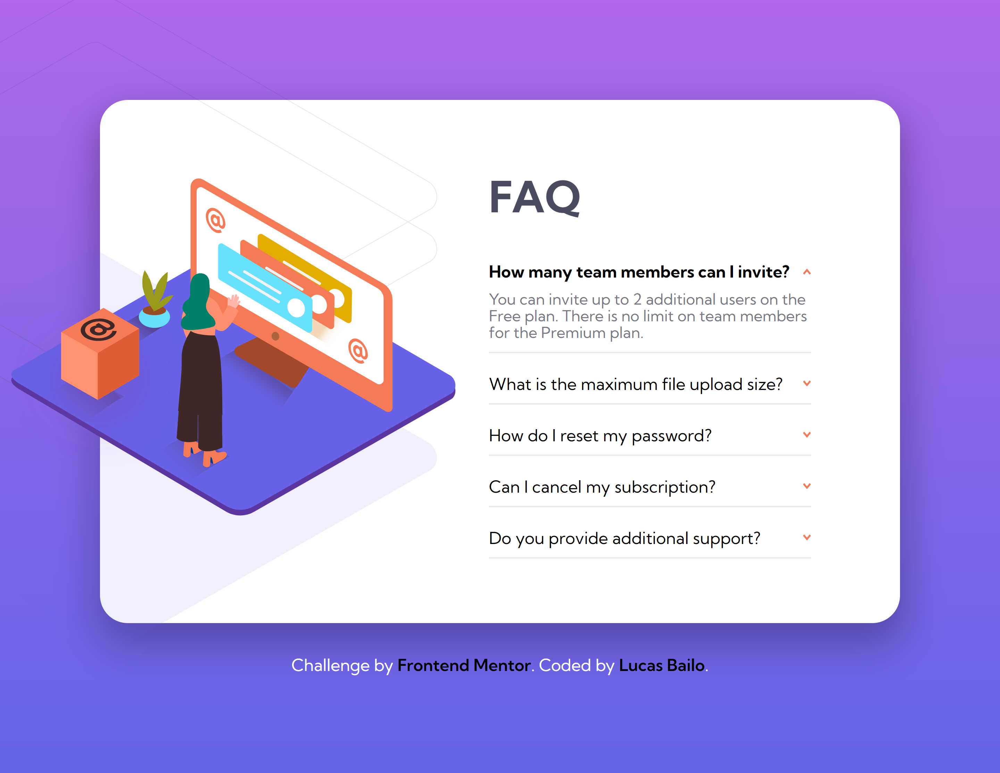

# Frontend Mentor - FAQ accordion card solution

This is a solution to the [FAQ accordion card challenge on Frontend Mentor](https://www.frontendmentor.io/challenges/interactive-rating-component-koxpeBUmI). Frontend Mentor challenges help you improve your coding skills by building realistic projects. 

### Screen Shot
- Desktop

- Mobile

    

### Built with

- Semantic HTML5;
- CSS custom properties;
- Flexbox;
- Responsive Desgin;

## Test the project on your device: [Teste the project here!!!](https://faq-card-psi.vercel.app/)

- Min-widths: 1036px - 720px -375px

## Author

- Website - [Lucas Bailo](https://github.com/lucasbailo)
- Frontend Mentor - [@lucasbailo](https://www.frontendmentor.io/profile/lucasbailo)
- Instagram - [@lucassbailo](https://www.instagram.com/lucassbailo/)
- LinkedIn - [Lucas Bailo](https://www.linkedin.com/in/lcsbailo/)